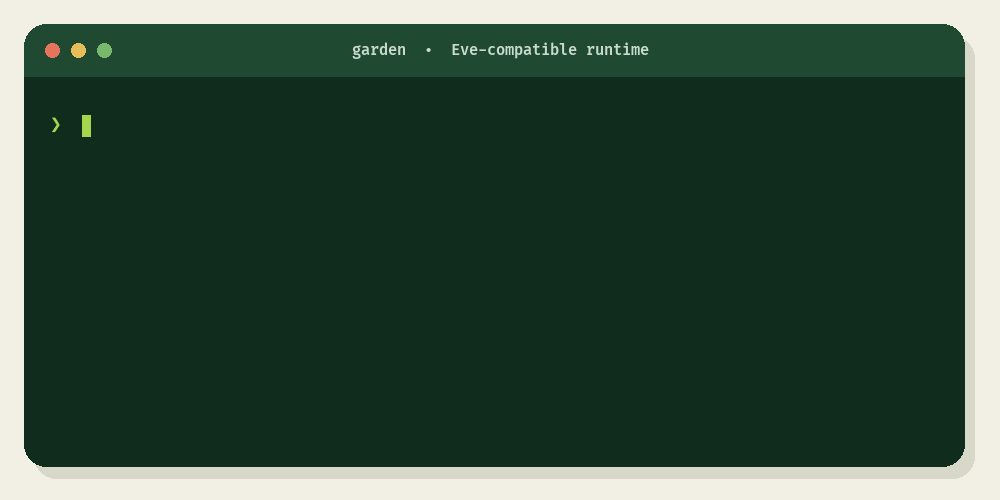

<div align="center">
  <h1>Garden</h1>
  <p><strong>Run Eve on your infrastructure.</strong></p>
  <p><strong><a href="https://garden.ta-0.com">Explore Garden on the web →</a></strong></p>
  <p>
    <a href="#quickstart">Quickstart</a> ·
    <a href="COMPATIBILITY.md">Compatibility</a> ·
    <a href="https://vercel.com/eve">Eve by Vercel</a>
  </p>
  <p>
    
    
    
  </p>
</div>

Garden is a self-hosted Go runtime for Eve-compatible agents. It can also
launch and supervise [Eve by Vercel](https://vercel.com/eve) when you need the
complete framework. In that mode, Eve remains fully in control.

<p align="center">
  <a href="https://garden.ta-0.com">
    
  </a>
</p>

The demo shows Garden discovering the included weather agent’s model, tool, and
skill. [Run the Quickstart](#quickstart) to inspect the agent and complete your
first turn.

## Quickstart

Building Garden from source requires Go 1.25 or newer. The native runtime runs
on macOS and Linux and needs either a Codex login or credentials for OpenAI,
Anthropic, Google, or an OpenAI-compatible endpoint.

Supervising Eve additionally requires Node.js 24 or newer and a project-local
installation of `eve@0.27.6`.

```sh
git clone https://github.com/thoriqakbar0/garden.git
cd garden
make build
```

This creates `./garden`. Inspect the included Eve weather agent:

```sh
./garden info --root examples/eve-weather
```

Run it with credentials created by the Codex CLI:

```sh
codex login
./garden run \
  --root examples/eve-weather \
  --message "What is the weather in Jakarta?"
```

A successful result has this shape; the model response varies:

```json
{"sessionId":"ses_<generated>","turnId":"turn_<generated>","message":"<model response>"}
```

Continue the same conversation with `--session`:

```sh
./garden run \
  --root examples/eve-weather \
  --session "ses_<generated>" \
  --message "And tomorrow?"
```

To run `garden` from any directory, install it in your user `PATH`:

```sh
make install
command -v garden
garden version
```

`make install` writes to `$HOME/.local/bin` by default. If `command -v` returns
no path, add that directory to your shell `PATH`:

```sh
export PATH="$HOME/.local/bin:$PATH"
```

Set `BINDIR` to install somewhere else:

```sh
make install BINDIR="$HOME/bin"
```

If `GARDEN_MODEL_BACKEND` is unset and `codex` is on `PATH`, Garden uses Codex
automatically. Otherwise, [configure a model backend](#model-configuration)
before running `garden run` or native `garden serve`. Supervised Eve uses the
Eve project’s provider configuration. Garden exits with an error when it cannot
find or use a native backend; it never substitutes a diagnostic echo.

Choose what to do next:

- [Run Eve through Garden](#run-eve-through-garden).
- [Configure a model backend](#model-configuration).
- [Serve the Eve-compatible HTTP API](#http-runtime).
- [Adapt an Eve-shaped project for native mode](#supported-native-project-shape).

## Compatibility

> [!WARNING]
> Garden does not implement Eve’s full TypeScript feature set. Use Eve
> itself—optionally supervised with `garden serve --runtime eve`—when you need
> full Eve behavior.

Choose the runtime that matches your project:

| Mode | Choose it when | What runs |
| --- | --- | --- |
| Eve by Vercel | You need the complete authored framework, including TypeScript modules and sandboxing. | Garden validates and supervises project-local `eve@0.27.6`; Eve owns execution and protocol behavior. |
| Garden native | You need the supported Eve-compatible subset in one self-hosted Go process. | Garden owns sessions, streaming, model and native-tool turns, cancellation, and local recovery. |

Read the complete [Eve compatibility matrix](COMPATIBILITY.md), the pinned
[upstream revision](UPSTREAM.md), and the supporting [test inventory](TESTING.md).

## Run Eve through Garden

Use this mode to run Eve itself instead of Garden’s native Go subset. Pin the
supported Eve version in your project:

```json
{
  "dependencies": {
    "eve": "0.27.6"
  }
}
```

Then start it through Garden:

```sh
npm install
/path/to/garden serve \
  --runtime eve \
  --root /path/to/eve-agent \
  --addr 127.0.0.1:3000
```

Garden validates the package version and project-local executable, starts
`eve dev --no-ui`, and supervises shutdown. It does not translate the agent or
intercept the protocol. Eve owns compilation, model calls, durable sessions,
routes, authorization, and sandbox selection. Eve receives the project
environment so authored tools and connections can use it.

Verify this path without provider credentials or Docker by running
`make test-official`. The test uses the checked-in
[Eve parity example](examples/eve-parity) and its pinned lockfile.

Eve’s built-in `bash`, `read_file`, `write_file`, `glob`, and `grep` tools run
inside Eve’s per-session sandbox, not in Garden. Configure and secure the
sandbox in the Eve project. Depending on the host, Eve may select Docker,
microsandbox, or the pure-JavaScript `just-bash` fallback.

`GARDEN_MODEL_BACKEND=codex` belongs to native mode and is not injected into the
Eve process. Likewise, Garden’s native bearer wrapper does not wrap Eve routes.
Keep Eve on loopback unless the project or a trusted reverse proxy provides the
intended external authorization.

## Model configuration

| Variable | Meaning |
| --- | --- |
| `GARDEN_MODEL_BACKEND` | Optional explicit selection: `openai`, `anthropic`, `google`, or `codex`. When empty, Garden selects Codex if `codex` is on `PATH`. |
| `GARDEN_MODEL` | Optional model override. When unset, native providers use the literal model discovered in `agent/agent.ts`; a matching `openai/`, `anthropic/`, or `google/` prefix is removed before its native API call. `codex` defaults to `gpt-5.6-sol`. |
| `GARDEN_CODEX_SANDBOX` | Optional Codex terminal policy: `workspace-write` (default) or `read-only`. Garden rejects `danger-full-access`. |
| `GARDEN_OPENAI_BASE_URL` | OpenAI-compatible API base. Defaults to `https://api.openai.com/v1` when an API key is set. |
| `GARDEN_OPENAI_API_KEY` | Optional upstream bearer credential; local endpoints and Cloudflare Gateway BYOK may omit it. |
| `GARDEN_ANTHROPIC_BASE_URL` | Anthropic Messages API base. Defaults to `https://api.anthropic.com/v1`. |
| `GARDEN_ANTHROPIC_API_KEY` | Required credential for the native Anthropic provider. |
| `GARDEN_GOOGLE_BASE_URL` | Google Generative Language API base. Defaults to `https://generativelanguage.googleapis.com/v1beta`. |
| `GARDEN_GOOGLE_API_KEY` | Required credential for the native Google provider; sent as `x-goog-api-key`, never in the request URL. |
| `GARDEN_CLOUDFLARE_GATEWAY_TOKEN` | Optional Cloudflare AI Gateway credential, sent only as `cf-aig-authorization`. |
| `CODEX_HOME` | Codex state directory, default `~/.codex`. |
| `GARDEN_AUTH_TOKEN` | Native mode only: required when `garden serve` binds beyond loopback; when set, also enforced on loopback. |

The `codex` backend delegates each turn to `codex exec --json`. Garden selects
it automatically when no backend is set and the Codex CLI is on `PATH`. Codex
can inspect the project and use terminal tools.

For each Codex turn, Garden:

- sets a ten-minute deadline
- disables interactive approvals
- limits the inherited environment to Codex’s core command variables
- blocks login-shell rehydration
- confines writes to the project root

Commands that need network access or files outside the sandbox fail instead of
waiting for approval.

Use read-only terminal access when the agent should inspect but never edit:

```sh
export GARDEN_CODEX_SANDBOX=read-only
```

Run the discovered `anthropic/claude-sonnet-5` model identifier through
Anthropic’s native Messages API:

```sh
export GARDEN_MODEL_BACKEND=anthropic
export GARDEN_ANTHROPIC_API_KEY="$ANTHROPIC_API_KEY"
./garden run --root examples/eve-weather --message "Weather in Jakarta?"
```

Use Google’s native `generateContent` API by selecting a Gemini model explicitly:

```sh
export GARDEN_MODEL_BACKEND=google
export GARDEN_GOOGLE_API_KEY="$GOOGLE_API_KEY"
export GARDEN_MODEL=google/gemini-2.5-flash
./garden run --root examples/eve-weather --message "Weather in Jakarta?"
```

OpenRouter’s free-model router works through the same adapter:

```sh
export GARDEN_MODEL_BACKEND=openai
export GARDEN_OPENAI_BASE_URL=https://openrouter.ai/api/v1
export GARDEN_OPENAI_API_KEY="$OPENROUTER_API_KEY"
export GARDEN_MODEL=openrouter/free
./garden run --root examples/eve-weather --message "Weather in Jakarta?"
```

Cloudflare Workers AI also exposes an OpenAI-compatible endpoint. Accounts with
free Workers AI allocation can run the example without a separate model-provider
account:

```sh
export CLOUDFLARE_ACCOUNT_ID=your-account-id
export GARDEN_MODEL_BACKEND=openai
export GARDEN_OPENAI_BASE_URL="https://api.cloudflare.com/client/v4/accounts/$CLOUDFLARE_ACCOUNT_ID/ai/v1"
export GARDEN_OPENAI_API_KEY="$CLOUDFLARE_API_TOKEN"
export GARDEN_MODEL=@cf/ibm-granite/granite-4.0-h-micro
./garden run --root examples/eve-weather --message "Weather in Jakarta?"
```

For Cloudflare AI Gateway’s OpenAI-compatible `/compat` endpoint, set that URL
as `GARDEN_OPENAI_BASE_URL`. If the gateway requires authentication, set
`GARDEN_CLOUDFLARE_GATEWAY_TOKEN`; Garden sends it in the dedicated
`cf-aig-authorization` header while keeping `GARDEN_OPENAI_API_KEY` available
for provider authentication.

The adapter accepts both standard JSON-object tool arguments and the
string-wrapped arguments returned by some compatible providers. Assistant tool
messages include explicit empty content for providers that require it.

Garden applies these limits:

- 1 MiB for provider requests, responses, native tool payloads, Codex prompts,
  and individual JSON event records
- 60 seconds for each OpenAI, Anthropic, or Google model or tool step
- eight model rounds per turn

Public errors never include credentials or upstream response bodies.

For the native provider backends, the compiled manifest currently binds only
`get_weather`. It returns fixture data to prove the execution boundary. A
declared tool without a native binding causes startup to fail. The `codex`
backend instead uses Codex’s sandboxed terminal runtime.

## HTTP runtime

The commands below use Garden’s native HTTP runtime, which listens on loopback
by default:

```sh
./garden serve --root examples/eve-weather
```

Check the server’s health and view redacted application information:

```sh
curl http://127.0.0.1:3000/health
curl http://127.0.0.1:3000/eve/v1/info
```

Create and start a session in one request:

```sh
curl -i \
  -X POST \
  -H 'content-type: application/json' \
  -d '{"message":"Weather in Jakarta?"}' \
  http://127.0.0.1:3000/eve/v1/session
```

The `202` response contains `sessionId` and `continuationToken`. Open the
session’s live protocol-v19 stream:

```sh
curl -N http://127.0.0.1:3000/eve/v1/session/ses_<id>/stream
```

Continue the session by sending its continuation token:

```sh
curl \
  -X POST \
  -H 'content-type: application/json' \
  -d '{"message":"And tomorrow?","continuationToken":"eve:<opaque>"}' \
  http://127.0.0.1:3000/eve/v1/session/ses_<id>
```

Cancel an active turn:

```sh
curl \
  -X POST \
  -H 'content-type: application/json' \
  -d '{"turnId":"turn_<id>"}' \
  http://127.0.0.1:3000/eve/v1/session/ses_<id>/cancel
```

Streams use `application/x-ndjson; charset=utf-8`, protocol version `19`, and
support `startIndex=N` for absolute or negative tail-relative replay.

### Native network exposure

Non-loopback binding requires authentication:

```sh
export GARDEN_AUTH_TOKEN="$(openssl rand -hex 32)"
./garden serve \
  --root examples/eve-weather \
  --addr 0.0.0.0:3000
```

Clients then send `Authorization: Bearer $GARDEN_AUTH_TOKEN`. A configured
token is enforced on loopback too, which lets a local TLS reverse proxy retain
Garden’s authentication boundary. Loopback requires no token only when the
variable is unset.

## Supported native project shape

For Garden native mode, only `agent/instructions.md` is required.

```text
my-agent/
├── agent/
│   ├── instructions.md
│   ├── agent.ts
│   ├── tools/
│   ├── skills/
│   ├── channels/
│   ├── connections/
│   ├── schedules/
│   └── subagents/
└── evals/
```

Garden reads paths and selected literal configuration. In native mode,
JavaScript and TypeScript files are declarations; Garden does not execute them.
The OpenAI, Anthropic, and Google providers select native tool bindings by their
discovered identifiers. The Codex backend can inspect and operate on the
project through its terminal.

## Workflow integrity

Session events live under:

```text
.eve/workflow-data/sessions/<session-id>.jsonl
```

Garden’s local workflow store:

- fsyncs each event before publishing it
- mirrors durable events in memory for cursor-linear replay
- assigns contiguous event indexes
- allows one active turn per session while independent sessions run concurrently
- opens session paths without following symlinks
- repairs partial tails and settles turns interrupted by a stopped process

Cancellation returns `accepted` only after its intent is durable. Settlement
ends with exactly one `turn.cancelled` followed by `session.waiting`. Recovery
finishes that boundary after a crash.

Native-provider tool arguments and results remain durable internal events.
Codex terminal records include lifecycle and exit status but omit command text
and output. The HTTP stream exposes only event types verified against the pinned
Eve v19 contract; absolute and negative cursors count that public projection.

The store is local and supports one writer. Back up the project together with
its `.eve` directory. When Garden first opens a pre-v19 session log, it validates
and atomically migrates the log in place. Garden stops startup if a log is
invalid or mixes formats rather than guessing how to migrate it.

## CLI

| Command | Behavior |
| --- | --- |
| `garden init [directory]` | Creates the minimum Eve-shaped project without overwriting files. |
| `garden info [--root directory]` | Prints the full local discovery result. |
| `garden run --message text [--root directory] [--session id]` | Runs one model turn and waits for its durable boundary. |
| `garden serve [--root directory] [--addr address] [--runtime native\|eve]` | Starts Garden’s native HTTP runtime by default, or supervises project-local Eve with `--runtime eve`. |
| `garden dev ...` | Alias of `serve`; no watcher or TUI. |
| `garden start ...` | Alias of `serve`. |
| `garden eval [--root directory] --list` | Lists discovered eval identifiers. |
| `garden version` | Prints the Garden version. |

## Development

```sh
make test-hermetic
make check
make test-official
make test-all
make list-tests
```

`make test-official` installs the pinned
[Eve parity example](examples/eve-parity) without requiring credentials, then
verifies authored TypeScript and sandbox execution through Eve. Read the
[testing guide](TESTING.md) for the test inventory, validation tiers,
live-provider smoke commands, and remaining evidence gaps.

The hermetic suite covers discovery, native OpenAI, Anthropic, and Google
providers, OpenAI-compatible endpoints, sandboxed Codex execution, the native tool loop, protocol-v19 create/continue/stream/cancel,
live flushing, cursor resume, continuation ownership, cancellation races,
session traversal rejection, concurrent sessions, and restart repair.

The same black-box contract can target pinned Eve fixtures with
`EVE_OFFICIAL_BASE_URL` and `EVE_OFFICIAL_CANCELLATION_BASE_URL`; see
[`official_test.go`](internal/contracttest/official_test.go). A skipped official
target is not counted as differential proof.

## Scope

Garden is an independent Apache-2.0 implementation. It is not affiliated with
or endorsed by Vercel or the Eve project. It was built out of love for Eve’s
open-source SDKs.

Eve defines the complete authored project shape and observable HTTP behavior;
Garden implements the documented compatible subset in Go. When Garden launches
Eve with `--runtime eve`, Eve—not Garden—owns execution, persistence, and serving.
Read the [Eve attribution and license details](THIRD_PARTY_NOTICES.md).
